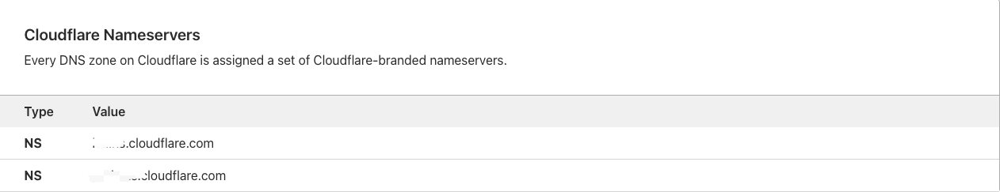

## cloudflare & 阿里云域名 实现docker proxy

### Prerequisites
1. 阿里云或者腾讯云域名一个(aaa.com/aaa.cn/aaa.fun),不需要服务器，域名即可
2. [cloudflare](https://dash.cloudflare.com/)账号

### Tools
1. [cloud_docker_proxy](https://github.com/ciiiii/cloudflare-docker-proxy)
> cloudflare 需要用到的work page 函数

### 知识储备
- 域名
```
简单来说域名就是代替IP，用来方便记忆的一个地址。一般分为主域名（根域名）和二级域名、子域名
例如：aaa.com为主域名 二级域名为www.aaa.com 子域名可以在二级域名下，例proxy.www.aaa.com
```
- 域名解析
```
域名解析其实就是通过DNS服务器把域名解析成IP的过程。DNS服务器是由权威机构认证使用，通过DNS服务器以及DNS记录快速找到域名对应的IP的解析工具
常见的DNS服务器：Google: 8.8.8.8 中国电信: 114.114.114.114
Linux配置文件:  /etc/resolv.conf
nameserver 8.8.8.8
nameserver 114.114.114.114
```

### 配置过程
1. 登录注册cloudflare -> Add a domain(域名) -> select Free plan，注册完成之后，会得到两个DNS服务器地址，如下图： 
  
2. 登录阿里云控制台 -> 域名控制台 -> 域名管理 -> DNS管理 -> 修改DNS服务器,如下图：
   
3. 部署cloudflare_docker_proxy项目
   1. 登录github,找到项目[cloud_docker_proxy](https://github.com/ciiiii/cloudflare-docker-proxy)
   2. 直接点击 **deploy** 按钮,在deploy过程中，需要关联cloudflare的accountId与api token,为了避免找不到accountId,可能需要初始化一个works:
   
   #### deploy前提
   1. init works,随便创建一个work.完成后如图：
   
   2. 创建cloudflare api Token
   ,直接使用模板创建，注意里面选项有个zone，要选择注册的域名
4. 部署完成之后，会有一个名叫cloudflare_docker_proxy的work，也会有一个cloudflare_docker_proxy_staging的work,这两个是根据github项目环境生成的，我们使用生产第一个.不需要改动work里面的函数，我们可以直接通过变量把我们的域名传入到works里面的函数里面。如图：

### 细节讲解
1. 假设你的域名是aaa.fun
完成上面步骤之后，接下来我们要做的就是配置域名及DNS Records
2. 首先需要在cloudflare DNS里面添加一条A记录,直接指向192.0.2.1 这个IP其实就是解析到cloudflare本地服务器，主要作用其实就是你访问域名的时候，DNS解析的时候能够被cloudflare解析，触发cloudflare work & page 项目里面的函数，work里面的函数其实就是一个转发到docker.io的代理。

根据aaa.fun域名 添加DNS A 记录，例: docker.proxy.aaa.fun targetIp: 192.0.2.1
3. 在manage works & pages页面，选择cloudflare_docker_proxy,在settings选项中，add domain & route,选择Route,不选择custom domain,输入 docker.proxy.aaa.fun/*,然后在variables选项里面CUSTOM_DOMAIN变量为proxy.aaa.fun

1. 代理的服务器即可根据docker.proxy.aaa.fun或者k8s.proxy.aaa.fun区分访问不同的服务器
2. 测试，在本机通过配置 /etc/docker/daemon.json，配置加速地址，配置为:['https://docker.proxy.aaa.fun']
3. 可以通过 docker pull docker.proxy.aaa.fun/busybox测试拉取镜像
4. 如果需要使用k8s镜像地址，需要在DNS Records里面配置一条A记录，同样的，以k8s.proxy开头，IP 配置成192.0.2.1